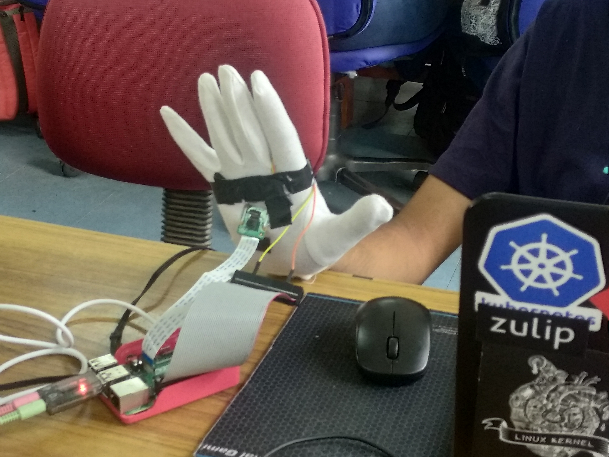
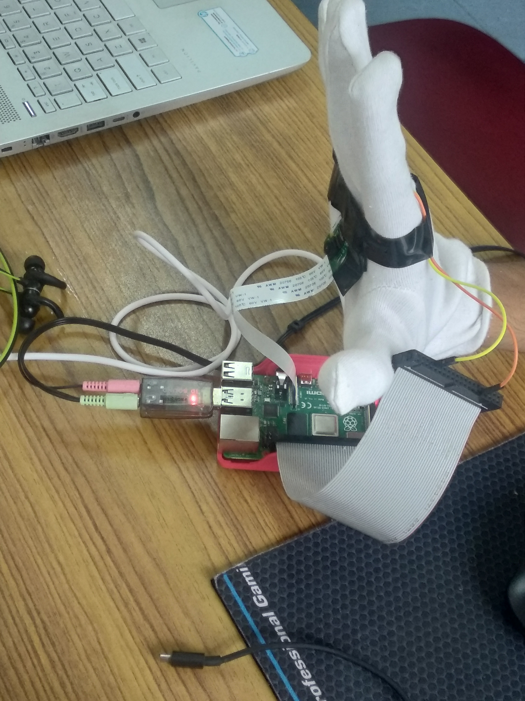
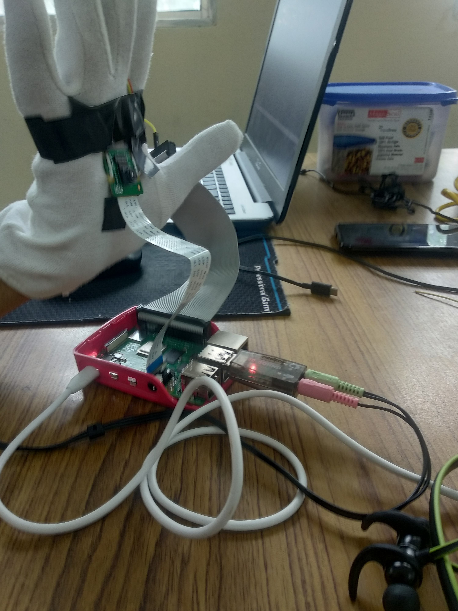

# The Blind Guide
Team Name: ​_destroyingRecursively_

Members: [​Saksham Arora](https://github.com/saksham20189575/), [Sayan Sengupta](https://github.com/S-CRACKER) and  [Ankur Dubey](https://github.com/ankurdubey521)

We built this project during **Hack-A-Bit 19**, and were awarded the **3rd Prize (2nd Runner Ups)**

## The Challenge:
Blind People on a daily basis struggle with finding common objects in their environment.
They must memorize the location of every obstacle or item in their home environment.
Objects like beds, tables and chairs must not be moved without warning to prevent
accidents. Our aim is to help the blind explore, find and interact with objects in their local
surroundings (for example, the room they are in) in a more efficient way.
Device Construction:

Our product is a hand mounted device. The major components are:

1) A camera pointing outwards from the palm for capturing video/images of objects in front of
the user.

2) Headphones and Microphone for voice commands and feedback.

3) A vibrator motor mounted in the glove for haptic feedback.
4) A Raspberry Pi for processing data.

## Working:
Video from the camera is used to determine a list of objects in the direction the user is
pointing (in front of his palm), and each object’s relative position (for eg., top down wrt the
user’s palm). This is achieved by using a Real Time Object Detection Model such as YOLO
on the video. We generate this list after fixed intervals of time, and use this information to
guide the user to a specific object. We plan to do this in the following ways:

1) Exploratory Mode​: The user scans his surroundings with his hand. At fixed intervals,
the user is presented a list of objects in front of him through voice output. At any point
of time the user may issue a command to focus on a particular object in a predefined
format, for example “Focus on the Bag”. The command will be processed using a
speech to text conversion API. Then we focus only on the bag. The Model returns the
coordinates of the bounding box of the bag wrt the video frame, we use this to
determine its position relative to the users palm, and tell the user to move in that
direction. Haptic feedback proportional to deviation from the direction of the bag is
provided to indicate that the user is moving in the wrong direction, enhancing the
user experience. Also, the distance between the user and target object may be
determined using the ratio of areas of the bounding box and video frame.

2) Predefined Object Detection Mode​: No object detection mechanism is perfect. Also,
there are many objects that a user may interact with on a daily basis, like a
smartphone. We can place special stickers on these objects to facilitate their
tracking. The sticker would be rectangular, and divided into 4 quadrants. Each
quadrant is assigned a specific color, for example Red Green Blue Yellow.

Using such an approach has two benefits

1) Instead of object detection, we can detect patches of colors in the video. Detecting
patches of colors is a simpler problem than object detection, so it can be used as a
fallback if the Model is unable to detect the said object.

2) While the probability of each color appearing separately in a frame at different points
is quite high, the probability of all four colors appearing in a quadrant is much lower,
which is what we plan to use to detect the stickers.
In this mode the user will be informed of any sticker labeled objects in front of him/her and
then directed to it using the same procedure as described in (1), if the user chooses to.

## Value Proposition:
1) The device would help the blind interact with their surroundings in a more efficient way.
2) Once setup, they can independently reach and interact with objects they want.
3) This can also be used to safely explore unknown surroundings.

## Pictures
 |  | 
